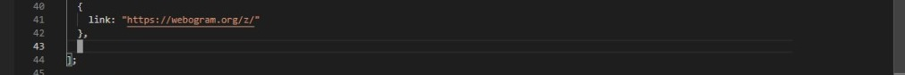

# Save links

Social media blocker is a an extension which will not allow you to use social media websites while you work 👇

## How to Install ?

1. Clone or download this repository.
2. extract the zip file.
3. Navigate to chrome://extensions/
4. Click on 'Toggle the developer mode'.
5. Click on 'Load Unpacked'
6. Select the complete folder which you extracted.

## Tech Stack

- HTML
- CSS
- JavaScript

## Add or Remove Websites

### Add site of your choice

1. Download the source code as zip
2. Open the background.js file in notepad or any text editor.(notepad++ recommended)
3. Copy this code < {
    link :" "
},  >
4. Paste it where the cursor is

5. Put the link of the website you want to block inside the double inverted commas.
6. Save the file.
7. Go to your browser and add the extension again. Remove the old one (if u have)
8. Your site of choice will be blocked now.

### Remove a Website

1. Delete the 3 lines of code for a particular website 
2. For example, Lets say u want to remove whatsapp and keep other websites blocked.
3. < 
 { 
    link: "https://web.whatsapp.com/",
   },
   
 delete the following code in order to do the same.
 
